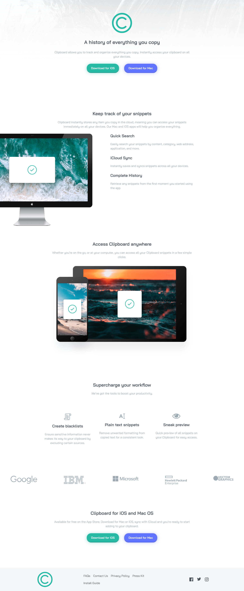

# Frontend Mentor - Clipboard Landing Page

This is a solution to the [Clipboard landing page challenge on Frontend Mentor](https://www.frontendmentor.io/challenges/clipboard-landing-page-5cc9bccd6c4c91111378ecb9). Frontend Mentor challenges help you improve your coding skills by building realistic projects.

## Table of contents

- [Overview](#overview)
  - [Screenshot](#screenshot)
  - [Links](#links)
- [My process](#my-process)
  - [Useful resources](#useful-resources)
- [Author](#author)

## Overview

### Screenshot

### Links

- Solution URL: [https://github.com/RighteousHundred/clipboard-landing-page](https://github.com/RighteousHundred/clipboard-landing-page)
- Live Site URL: [https://clipboard-landing-page-solution.netlify.app](https://clipboard-landing-page-solution.netlify.app)

## My process

### Useful resources

- [Prepros](https://www.prepros.io) - I used Prepros in this project to compile my SCSS and make a live browser preview for me. This is a very effective tool that I would look forward to exploring.
- [Tabnine](https://www.tabnine.com) - Tabnine is an A.I. code autocompletion tool. It's awesome because it saved me a lot of time in the development of this project.

## Author

- YouTube - [EvanWebDev](https://www.youtube.com/channel/UCabhFpBls98B-O5QfVnGu4Q)
- Frontend Mentor - [@RighteousHundred](https://www.frontendmentor.io/profile/RighteousHundred)
- CodePen - [@Penguin-Coder](https://codepen.io/Penguin-Coder)